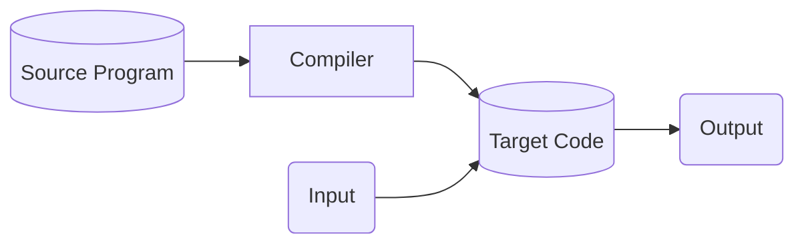
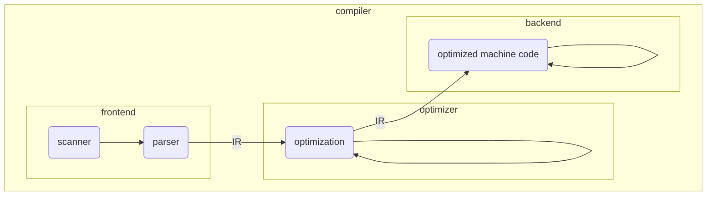

# Lecture 1

- What is a complier?
  - Compilers are large, complex, carefully engineered objects. It must
    - preserve the meaning of the program being compiled.
    - improve the input program in some discernible way

- Examples: text to figure, html to latex, high-level language to low-level language, etc.

- Why study compiler?

---

## Compiler Structure

- **scanner**: identifies distinct words in the input program and to classify each word
- **parser**: derives the output and generates annotated parse tree.
- **intermediate representation (IR)**: Some IRs represent the program as a graph. Others resemble a sequential assembly code program.
- **optimizer**: discovers facts about that context of the code to rewrite the code in a more efficient way
- **back-end**: emits code for the target machine

## Scanner
- Converts a sequence of characters to a sequence of tokes
- Recognition of Tokens ... recognize each word ... word by word  
  - Example:
    convert the stream of characters
    <section>
      <pre><code data-trim data-noescape>
        (1,red),(1,2)
      </code></pre>
    </section>
    to
    <section>
      <pre><code data-trim data-noescape>
        open_paranthesis (
        number 1 
        comma , 
        color red
        ...
      </code></pre>
    </section>
- Scanner may use regular expression or finite automatone in the conversion process
